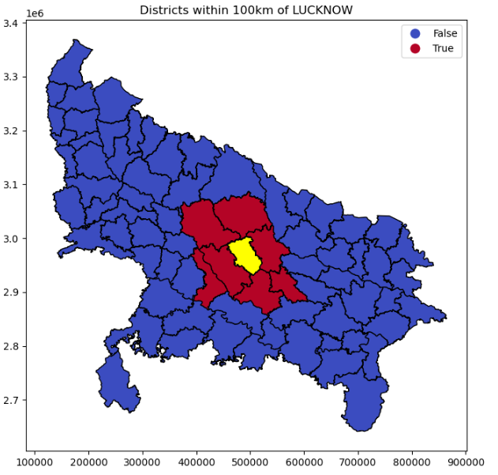

# UP_nearest_facility_project
# UP Nearest Facility Analysis

A GeoPandas + PostGIS project analyzing which districts in Uttar Pradesh fall within a defined distance of a chosen facility location (e.g., Lucknow), using spatial buffering and distance analysis.

## Problem Statement
Given a facility located in a specific district, identify which other districts fall within a set radius (e.g., 100km) — useful for planning service coverage, logistics, or resource allocation.

## Approach
1. Loaded Uttar Pradesh district boundaries as a GeoDataFrame
2. Reprojected to a UTM CRS (EPSG:32644) for accurate distance measurement in meters
3. Selected a facility district (Lucknow) and computed its centroid
4. Created a buffer zone (100km) around the facility centroid
5. Calculated the distance from every district's centroid to the facility
6. Flagged each district as "within buffer" or "outside buffer"
7. Exported results to PostGIS for spatial SQL querying and validation

## Tech Stack
- Python
- GeoPandas / Shapely
- Matplotlib
- PostgreSQL + PostGIS
- SQLAlchemy

## Results

Districts within 100km of Lucknow: Unnao, Barabanki, Sitapur, Raebareli, Kanpur, Hardoi, Amethi (Lucknow itself included).

## How to Run
1. Install dependencies: `geopandas`, `shapely`, `matplotlib`, `sqlalchemy`, `psycopg2`, `geoalchemy2`
2. Open `notebooks/up_nearest_facility_project.ipynb`
3. Update the PostGIS connection string with your own credentials
4. Run all cells

## Future Improvements
- Use real facility locations (hospitals/schools) instead of district centroids
- Add population data to weight the analysis
- Build an interactive map using `folium` or `geopandas.explore()`
